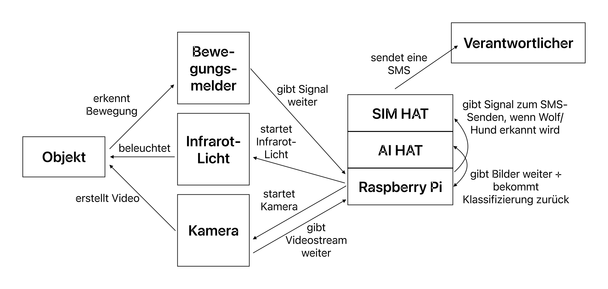

# Jugend forscht: Wolfserkennung

## 1. Idee
Ich war schon immer ein Tierfreund, und als ich wiederholt Artikel im *Stader Tageblatt* gelesen habe, dass Wölfe, die Weidetiere wie Schafe oder Rinder reißen, zum Abschuss freigegeben werden, entstand die Idee zu meinem Projekt. Eine Zusammenarbeit mit der Wolfsberaterin Svenja Oßenbrügge ergab, dass ein KI-unterstütztes Kamerasystem sehr wichtig für das Wolfsmonitoring wäre, da die Hälfte der Wolfsrisse mutmaßlich auf Hunde zurückzuführen sind. Eindeutige Bilder sorgen für Aufklärung, und mein entwickeltes Alarmsystem kann Tiere schützen.

## 2. Ziel
- Das neuronale Netzwerk aus dem Vorjahr verbessern und so anpassen, dass es sowohl Hunde als auch Wölfe erkennen kann.
- Das neuronale Netzwerk mit dem Raspberry Pi verbinden.
- Die Kamera aus dem Vorjahr verbessern.
- Eine Möglichkeit einbauen, dass der Raspberry Pi unabhängig von WLAN-Netzwerken eine SMS senden kann.
- Alles in einer funktionalen Kamerabox verbinden, die bei einer Bewegung ein Video aufnimmt, dieses klassifiziert und gegebenenfalls eine SMS-Nachricht an den Verantwortlichen sendet.

## 3. Vorgehensweise
### 3.1 Wie bin ich vorgegangen?
- Trainingsdaten mit Roboflow vorbereitet.
- Mit YOLOv8 ein Modell erstellt.
- Modell auf Google Colab trainiert.
- Modell in das `.hef`-Format konvertiert.
- Python-Programm geschrieben, das auf dem Raspberry Pi läuft und bei einer Bewegung den Kamera-Stream mit der Klassifizierung öffnet.

### 3.2 Problemlösemethoden bei der KI-Entwicklung
Problem aufgetreten → Hypothese aufstellen → Versuch entwickeln → erneut testen → ggf. einsatzbereit machen oder weitere Lösungen entwickeln.

### 3.3 Verwendete Hardware
#### 3.3.1 Raspberry Pi
Der Raspberry Pi ist ein Minicomputer. Auf diesem läuft das Python-Programm, welches sozusagen alles koordiniert.

#### 3.3.2 Raspberry Pi Kamera v3
Ich verwende die Raspberry Pi Kamera v3, die im Gegensatz zu meiner vorherigen Kamera einen Autofokus hat und keinen Infrarotfilter besitzt. Dadurch kann ich einen Infrarot-Scheinwerfer verwenden.

#### 3.3.3 SIM-HAT
Zur SMS-Benachrichtigung setze ich das Waveshare SIM7600E-H 4G HAT ein, womit der Raspberry Pi unabhängig von WLAN-Netzwerken SMS versenden kann.

#### 3.3.4 Infrarot-LED
Um auch nachts Aufnahmen zu ermöglichen, nutze ich eine Infrarot-LED, die für meine Kamera sichtbar ist, aber andere Tiere nicht stört.

#### 3.3.5 AI-HAT
Mein vorheriges System benötigte ca. 20-30 Sekunden zur Bildverarbeitung. Mit dem Raspberry Pi AI HAT (13 TOPS) kann ich einen 30fps-Videostream live verarbeiten. Dadurch wird das System echtzeitfähig, was eine schnellere Alarmierung ermöglicht.

## 4. Tests
### 4.1 Vorversuch mit meiner Katze
Viele Funktionalitäten meines Systems wurden an meiner Katze entwickelt und getestet.

### 4.2 Hund
Da ich keinen eigenen Hund habe, testete ich die KI mit Hunden von Freunden und Bekannten – sowohl mit einem Videostream als auch mit einzelnen Bildern. Die Erkennungsrate war hoch; wenn ein Hund nicht erkannt wurde, lag es meist daran, dass er weit hinten im Bild war.

### 4.3 Wolf
Um die KI an echten Wölfen zu testen, besuchte ich den Wildpark Schwarze Berge. Dort unterstützte mich die Wolfsberaterin Svenja Oßenbrügge beim Anlocken der Wölfe. Die Genauigkeit meiner KI war sehr zufriedenstellend. Eine Schwäche zeigte sich bei liegenden Wölfen, da es hiervon nur wenige Trainingsbilder gab.

## 5. Was ist neu?
- Raspberry Pi
- AI-HAT
- SIM-HAT
- Raspberry Pi Kamera
- Neuronales Netzwerk
- Infrarot-LED
- Python-Programm
- 3D-gedruckte Box

## 6. Zielerreichung
- Ich habe das neuronale Netzwerk mit YOLOv8 verbessert.
- Die KI kann nun Hunde und Wölfe erkennen, was entscheidend für das Wolfsmonitoring ist.
- Meine Kamera hat jetzt Autofokus.
- Der Raspberry Pi kann nun SMS-Nachrichten verschicken.
- Alle Komponenten sind in einer funktionalen Kamerabox integriert.

## 7. Ergebnisdiskussion
Mein Kamerasystem soll Tierhalter wie Schafhirten vor angreifenden Hunden oder Wölfen warnen, damit sie rechtzeitig reagieren und ihre Tiere schützen können. Außerdem soll es Wolfsberatern bei Wildrissen helfen, zwischen Hund und Wolf zu unterscheiden und wichtige Erkenntnisse über das Verhalten von Wölfen liefern. Derzeit fehlen oft Bild- oder Videobeweise bei Wolfsrissen, sodass Entscheidungen nur auf DNA-Proben und Angriffsweisen basieren. Videoaufnahmen könnten Fehleinschätzungen minimieren und das Wolfsmonitoring verbessern. 

Alle Systemkomponenten wurden erfolgreich getestet: Der Bewegungsmelder funktionierte mit meiner Katze, und die KI erkannte zuverlässig Hunde und Wölfe – dies konnte ich mit echten Tieren bestätigen. Mein System ist nun echtzeitfähig, wetterfest, tag- und nachttauglich sowie internetfähig. 

In Zukunft könnte eine Zusammenarbeit mit kompetenten Partnern wie Schäfern, Jägern, Wolfsberatern, Verhaltensforschern, Rangern oder Wildhütern angestrebt werden.

## 8. Danksagung
Ich möchte mich herzlich bei all jenen bedanken, die mich bei meinem Projekt unterstützt und motiviert haben:
- **Privatdozent Dr. Carmesin**, der mein Projekt betreut und mir bei der Organisation geholfen hat.
- **Frau von Bargen**, die mir mit viel Geduld, Interesse und Hilfsbereitschaft insbesondere beim Schreiben der Langfassung zur Seite stand.
- **Svenja Oßenbrügge**, Wolfsberaterin des Landkreises Hamburg-Harburg, sowie dem *Wildpark Schwarze Berge* für wertvolle Informationen und Unterstützung bei der Wolfsbeobachtung.
- **Jannes Ruder** für das 3D-Modelling und Drucken meiner Box.
- **Florian von Bargen und meiner Familie**, die stets ein offenes Ohr für mich hatten.
